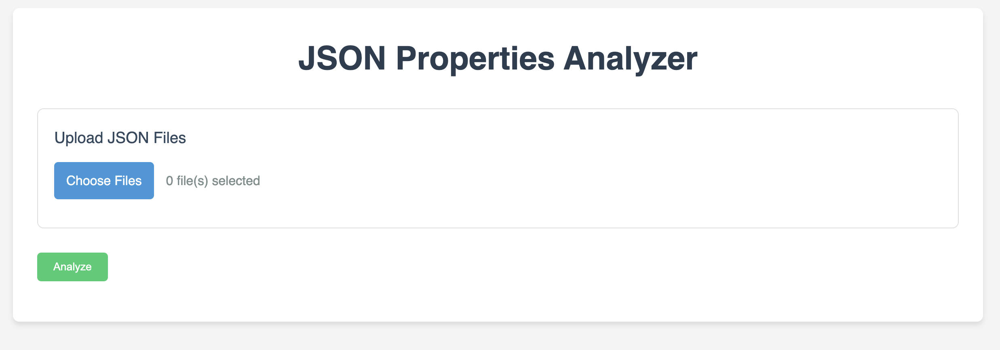

# JSON Analyzer 📊

## Overview 🌐

The JSON Analyzer is a web-based tool designed to help developers, data analysts, and businesses visualize and understand complex JSON data structures across multiple files. By processing JSON files, this tool creates a comprehensive view of the data, highlighting changes in properties over time or across different files.

## Features ✨

- **File Upload**: Easily upload multiple JSON files for analysis.
- **Interactive Analysis**: Dynamically analyze and display JSON data information.
- **Responsive Table**: View data in a responsive table format with horizontal scrolling and a fixed property column.
- **Change Highlighting**: Easily identify changes in properties between different JSON files with highlighted cells.
- **Export Functionality**: Export analyzed data in both JSON and CSV formats for further processing or reporting.
- **Error Handling**: Robust error handling for file parsing and analysis processes.

## Technical Specifications ⚙️

- **Language**: HTML5, CSS3, JavaScript (ES6+)
- **Dependencies**: None (vanilla JavaScript implementation)
- **Browser Compatibility**: Modern web browsers (Chrome, Firefox, Safari, Edge)

## Installation 🛠️

1. Clone this repository or download the HTML file.
2. No additional installation steps are required as this is a client-side application.

## Screenshot 📸


## Usage 📂

1. Open the `index.html` file in a modern web browser.
2. Click on "Select Files" to upload your JSON files.
3. Click "Analyze JSON" to process the files and display the results.
4. Use the horizontal scroll to view all columns of the analysis.
5. The property column remains fixed for easy reference while scrolling.
6. Cells highlighted in yellow indicate a change in value from the previous file.
7. Use the "Export JSON" or "Export CSV" buttons to download the analyzed data.

## JSON File Format 📄

The analyzer can process any valid JSON files. For timestamp-based analysis, it expects JSON files with a structure similar to:

```json
{
  "timestamp": "2023-04-01T12:00:00Z",
  "properties": {
    "property1": "value1",
    "property2": "value2",
    ...
  }
}
```

However, it can analyze any JSON structure, adapting to the properties found in the files.

## Best Practices 🌟

- Ensure your JSON files are properly formatted to avoid parsing errors.
- For optimal performance, limit the number of files and the size of the JSON payloads.
- When analyzing large datasets, consider using a device with a larger screen for better visibility.

## Troubleshooting 🛠️

- If files fail to upload, ensure they are in a valid JSON format.
- Clear your browser cache if you encounter persistent issues.
- Check the console in your browser's developer tools for any error messages.

## Contributing 🤝

We welcome contributions to improve the JSON Analyzer. Please feel free to submit issues or pull requests to our repository.

## License 📜

This project is licensed under the MIT License - see the LICENSE file for details.

---

Thank you for using the JSON Analyzer. We hope this tool provides valuable insights into your JSON data structures!
