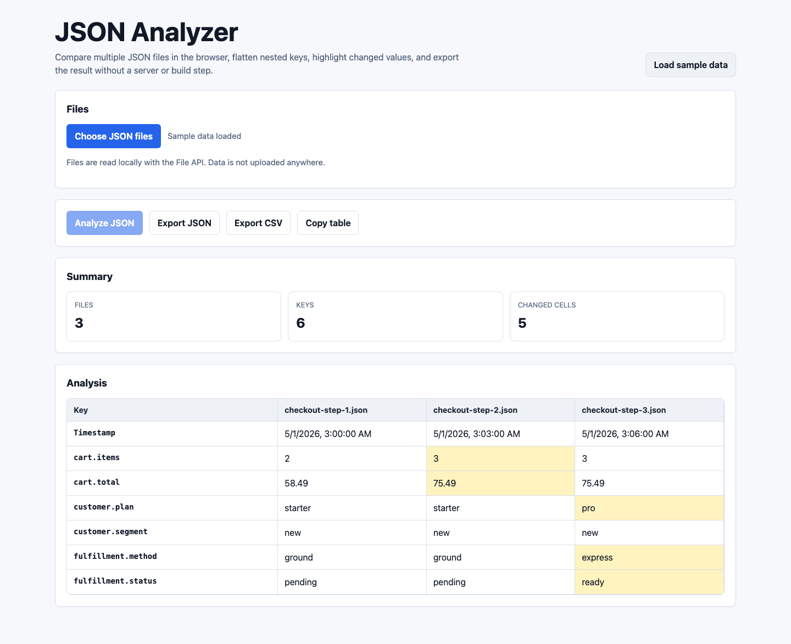

# JSON Analyzer HTML

A dependency-free static HTML sample for comparing properties across multiple JSON files in the browser.

The app flattens nested JSON keys, displays values across files in a horizontally scrollable table, highlights changed cells, and supports JSON/CSV export. It runs entirely client-side, so files are read locally and are not uploaded to a server.

## Features

- Single-file static app in `index.html`
- Multiple `.json` file upload
- Built-in sample data for quick testing
- Nested key flattening with dot paths and array indexes
- Change highlighting between adjacent files
- Sticky key column for wide comparisons
- Export results as JSON or CSV
- Copy table as tab-separated text
- No build step and no runtime dependencies

## Usage

Open `index.html` directly in a browser, or serve the folder with any static file server.

```sh
python3 -m http.server 8080
```

Then open [http://localhost:8080](http://localhost:8080).

## Expected JSON Shape

The analyzer accepts any valid JSON object. If a file contains a `properties` object, that object is used as the comparison root and `timestamp` is used for ordering/display:

```json
{
  "timestamp": "2026-05-01T10:00:00Z",
  "properties": {
    "customer": {
      "plan": "starter"
    },
    "cart": {
      "items": 2
    }
  }
}
```

If `properties` is not present, the full JSON object is analyzed.

## Privacy

Uploaded files are read with the browser File API. The sample has no server calls and does not persist payloads.

Do not use sensitive production data in a hosted copy unless you control and trust that hosting environment.

## Screenshot



## Contributing

Contributions are welcome. Keep the sample dependency-free unless there is a clear reason to add a build tool or framework.

## License

MIT. See [LICENSE](LICENSE).
